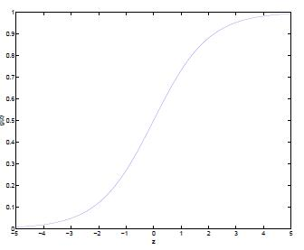

原文：http://cs229.stanford.edu/notes/cs229-notes1.pdf  
翻译：[MIL Learning Group](https://github.com/milLearningGroup/Stanford-CS229-CN) - [你的GitHub ID](#对应链接地址)

# Part II 分类与逻辑回归（Classification and logistic regression）

现在让我们来讨论一下分类问题。这和回归问题很类似，不过我们现在想要预测的 $y$ 值是数量很少的一些离散值。首先，我们把目光放在 **二分类（binary classification）** 问题上，也即是说 $y$ 只有两种取值可能，0 或者 1 。（而我们提到的分类问题大多数时候是推广到多类别情形下的。）例如，如果我们想要建立一个垃圾邮件分类器，那么 $x^{(i)}$ 可能是一封邮件的某些特征，$y$ 为1则表示这是一封垃圾邮件，为0则表示不是。在这里，0也被称为 **负类（negative class）** ，1也被称为 **正类（postive class）** ，他们有时候也会用符号 “+” 和 “-” 来定义。给定 $x^{(i)}$ ，则对应的 $y^{(i)}$ 也被称作这个训练样本的 **标签（label）** 。

## 5 Logistic 回归（Logistic regression）

>  注：Logistic 回归的中文译法当前主要有“逻辑回归”和“逻辑斯蒂回归”两种，这里保留了英文原名，希望大家能够认出。

我们可以通过忽略 $y$ 是一个离散值从而解决分类问题，也即是使用原始的线性回归算法尝试在给定 $x$ 的情况下预测 $y$ 。然而，很容易用例子证明这样的方法是不靠谱的。从直觉上看，当我们知道 $y\in\{0,1\}$ 时，预测值 $h_\theta(x)$ 如果超过 1 或者小于 0 ，也就没有了意义。  

为了满足我们的需求，我们将改变假设 $h_\theta(x)$ 的形式，选择下面的函数：  

$$ h_\theta(x)=g(\theta^Tx)=\frac {1}{1+e^{-\theta^Tx}}$$

其中 $g(z)=\frac {1}{1+e^{-z}}$ 被称为 **logistic 函数（logistic function）** ，此处使用的也被叫作 **sigmoid 函数（sigmoid function）** ，下面是图示：  

注意到当 $z\rightarrow \infty$ 时，$g(z)$ 趋近于 1， $z\rightarrow -\infty$ 时，$g(z)$ 趋近于 0 ，因此也表明了 $h(x)$ 总是位于 0 和 1 之间。和之前一样，我们约定了特征 $x_o=1$ ，因此有 $\theta^Tx=\theta_0+\sum^n_{j=1}\theta_j x_j$ 。

从现在开始，我们把 $g$ 当作是给定的函数了。其它能够从0到1之间光滑递增的函数也可以被使用，但是这其中有一些原因我们以后会讲到（当讲到广义线性模型GLMs和生成学习算法时），logistic 函数的选择是十分合理自然的。在继续我们的下一个话题前，这里有一个关于 sigmoid 函数导数的重要推导，我们写作 $g'$ :  
$$
g'(x) = \frac{d}{dz}\frac {1}{1+e^{-z}} \\
        =\frac {1}{(1+e^{-z})^2} (e^{-z})  \\
        = \frac {1}{(1+e^{-z})}  (1-\frac {1}{(1+e^{-z})} ) \\
        = g(z) (1-g(z))
$$
那么，在给定了 logistic 回归模型后，我们如何根据它来拟合 $\theta$ 呢？我们之前已经讲过了，在一系列假设的前提下，如何使用极大似然估计来推导出最小二乘回归。让我们赋予我们的分类模型一系列的概率假设，接着通过极大似然来拟合参数：  

让我们假设：  

$$ P(y=1\mid x;\theta) = h_\theta(x) $$

$$ P(y=0\mid x;\theta) = 1-h_\theta(x) $$

注意，上面的式子可以改写成一个更加简洁的形式：  

$$p(y\mid x;\theta)=(h_\theta(x))^y(1-h_\theta(x))^{1-y}$$

假定给定的 $m$ 个样本之间都是相互独立的，我们可以这样写参数的似然函数：  

$$ 
L(\theta) = p(\overset{\rightarrow}{y} \mid X;\theta) \\ = \prod_{i=1}^{m} p(y^{(i)}\mid x^{(i)};\theta) \\ =  \prod_{i=1}^{m}  (h_\theta(x^{(i)}))^{y^{(i)}}(1-h_\theta(x^{(i)}))^{1-y^{(i)} } 
$$

与前面的做法一样，最大化对数似然的形式会简单一些：

$$ $$

## 6 Digression: The perceptron learning algorithm

## 7 Another algorithm for maximizing ℓ(θ)

