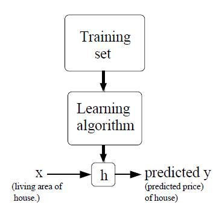

原文：http://cs229.stanford.edu/notes/cs229-notes1.pdf
翻译：[MIL Learning Group](https://github.com/milLearningGroup/Stanford-CS229-CN) - [AcceptedDoge](https://github.com/AcceptedDoge)

# 监督学习（Supervised learning）

让我们先从几个使用监督学习来解决问题的实例谈起。假设我们有一个**数据集（dataset）**，其中给出的是俄勒冈州波特兰市（Portland, Oregon）中的47套房屋的居住面积（Living area）和价格（Price）。  

| Living area ($feet^2$) | Price (1000$s) |
| :--------------------: | :------------: |
|          2104          |      400       |
|          1600          |      330       |
|          2400          |      369       |
|          1416          |      232       |
|          3000          |      540       |
|          ...           |      ...       |

我们可以根据上面的数据（data）绘制出下面的图形：  

给出的数据就像上面这样，那么我们要如何学习一个**函数（function）**，来根据居住面积的大小**预测（predict）**在波特兰地区其它房屋的价格呢？

在这里我们先规定一下**符号（notation）**和**定义（definition）**，它们在将来还会用到。我们将使用 $x^{(i)}$ 来表示 “**输入（input）”** 变量（在这个例子中就是房屋的面积），这也被称作输入的**特征（feature）**。使用 $y^{(i)}$ 来表示 “**输出（output）**” 或者 **目标（target）** 变量，即是我们想要去预测的值（这个例子中是指价格）。我们用来学习的数据集——含有$m$个训练样本 $\{(x^{(i)},y^{(i)});i=1,...,m\}$ 的列表——被称作是**训练集（training set）**。注意上标 “ $(i)$ “ 在符号表示中只是训练集的**索引（index）**记号，与数学中的求幂无关。另外我们使用 $ \cal X$ 来表示输入值的空间，使用 $ \cal Y $ 来表示输出值的空间。在这个例子中，输入和输出空间都是实数域，即 $ \cal X = \cal Y = \mathbb R$ .

接下来对监督学习问题给出一个更加正式的描述：我们的目标是，给定一个训练集，学习一个函数 $h:\cal X \mapsto \cal Y $ ，使得 $h(x)$ 对于 $y$ 的真实值而言是一个 ”好的（good）“ 预测结果。由于历史原因，函数 $h$ 被称为 **假设（hypothesis）**。从图片上看，整个过程是是这样的：  

当我们试图预测的目标变量是连续（continuous）的，就像我们的房屋面积-价格的例子一样，这样的学习问题被称为 **回归（regression）**问题。当 $y$ 只能取一小部分离散（discrete）值时（比如给定房屋面积，我们要来确定这个房子是一个住宅还是公寓），这样的学习问题被称为 **分类（classification）**问题。

# Part I 线性回归（Linear Regression）

为了让我们的房屋例子更有趣，让我们稍微对数据集进行一下补充，增加上每一个房屋的卧室（bedrooms）数目：  

此处的输入特征 $x$ 是一个在 $\mathbb R^2$ 空间的二维向量，例如 $x_1^{(i)}$ 就是训练集中第 $i$ 个房屋的面积，而$x_2^{(i)} $ 就是训练集中第 $i$ 个房屋的卧室数目。（通常来说，设计一个学习算法的时候，选择哪些**输入特征**都取决于你，所以当你在波特兰收集房屋的信息数据时，也完全可以选择包含其他的**特征**，例如房屋是否有壁炉，卫生间的数量等等。关于特征筛选的内容会在后面的章节进行更详细的介绍，不过目前来说就暂时先用给定的这两个特征了。）  

要进行这个监督学习任务，我们必须得决定如何在计算机里面对这个函数/假设 $h$ 进行表示。作为起始的选择，我们把 $y$ 近似为一个以 $x$ 为变量的线性函数（linear function）：  

$$ h_{\theta}(x) = \theta_0+\theta_1x_1+\theta_2x_2$$

这里的 $\theta_i$ 是**参数（parameters）**，也被叫作**权重（weights）**，用来参数化从 $\cal X$  到 $\cal Y$ 的线性函数映射空间。为了避免混淆，我们可以把 $h_{\theta}(x)$  里面的 $\theta$ 省略掉，简写成 $h(x)$。为了简化符号，我们还引入了约定使 $x_0=1$ （即**截距项 intercept term**），因此：  

$$ h(x)=\sum_{i=0}^{n}{\theta_ix_i}=\theta^Tx $$ ,     

右边等式的 $\theta$ 和 $x$ 都是向量，等式中的 $n$ 是输入特征变量的个数（不包括$x_0$）。   

现在，给定了一个**训练集**了，咱们怎么来挑选/学习参数 $\theta$ 呢？一个看上去比较合理的方法就是让 $h(x)$ 尽量逼近 $y$ ，至少对已有的训练样本能适用。用公式的方式来表示的话，就要定义一个函数，来衡量对于每个不同的 $\theta$ 值，预测值 $h(x^{(i)})$ 与实际对应的 $y^{(i)}$ 有多接近。我们据此定义了一个 **成本函数 （cost function）**，有的中文文献亦称之为**代价函数**：  

$$ J(\theta)=\frac {1}{2} \sum_{i=1}^{m} {(h_\theta(x^{(i)})-y^{(i)})} ​$$.  

如果之前你接触过线性回归，你会发现这个函数和**普通最小二乘法（ordinary least squares）**拟合模型中的最小二乘法成本函数非常相似。不管你之前是否接触过它，我们先继续往下看，以后就会发现这是一个更广泛的算法家族中的一个特例。