原文：http://cs229.stanford.edu/notes/cs229-notes1.pdf  
翻译：[MIL Learning Group](https://github.com/milLearningGroup/Stanford-CS229-CN) - [AcceptedDoge](https://github.com/AcceptedDoge)

# 监督学习（Supervised learning）

让我们先从几个使用监督学习来解决问题的实例谈起。假设我们有一个**数据集（dataset）**，其中给出的是俄勒冈州波特兰市（Portland, Oregon）中的47套房屋的居住面积（Living area）和价格（Price）。  

| Living area ($feet^2$) | Price (1000$s) |
| :--------------------: | :------------: |
|          2104          |      400       |
|          1600          |      330       |
|          2400          |      369       |
|          1416          |      232       |
|          3000          |      540       |
|          ...           |      ...       |

我们可以根据上面的数据（data）绘制出下面的图形：  

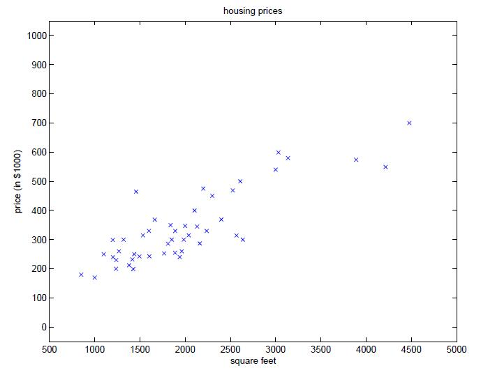

给出的数据就像上面这样，那么我们要如何学习一个**函数（function）**，来根据居住面积的大小**预测（predict）**在波特兰地区其它房屋的价格呢？

在这里我们先规定一下**符号（notation）**和**定义（definition）**，它们在将来还会用到。我们将使用 $x^{(i)}$ 来表示 “**输入（input）”** 变量（在这个例子中就是房屋的面积），这也被称作输入的**特征（feature）**。使用 $y^{(i)}$ 来表示 “**输出（output）**” 或者 **目标（target）** 变量，即是我们想要去预测的值（这个例子中是指价格）。我们用来学习的数据集——含有$m$个训练样本 $\{(x^{(i)},y^{(i)});i=1,...,m\}$ 的列表——被称作是**训练集（training set）**。注意上标 “ $(i)$ “ 在符号表示中只是训练集的  **索引（index）** 记号，与数学中的求幂无关。另外我们使用 $ \cal X$ 来表示输入值的空间，使用 $ \cal Y $ 来表示输出值的空间。在这个例子中，输入和输出空间都是实数域，即 $ \cal X = \cal Y = \mathbb R$ .

接下来对监督学习问题给出一个更加正式的描述：我们的目标是，给定一个训练集，学习一个函数 $h:\cal X \mapsto \cal Y $ ，使得 $h(x)$ 对于 $y$ 的真实值而言是一个 ”好的（good）“ 预测结果。由于历史原因，函数 $h$ 被称为 **假设（hypothesis）**。从图片上看，整个过程是是这样的：  

当我们试图预测的目标变量是连续（continuous）的，就像我们的房屋面积-价格的例子一样，这样的学习问题被称为**回归**（regression）问题。当 $y$ 只能取一小部分离散（discrete）值时（比如给定房屋面积，我们要来确定这个房子是一个住宅还是公寓），这样的学习问题被称为**分类**（classification）问题。

# Part I 线性回归（Linear Regression）

为了让我们的房屋例子更有趣，让我们稍微对数据集进行一下补充，增加上每一个房屋的卧室（bedrooms）数目：  

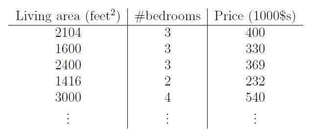

此处的输入特征 $x$ 是一个在 $\mathbb R^2$ 空间的二维向量，例如 $x_1^{(i)}$ 就是训练集中第 $i$ 个房屋的面积，而$x_2^{(i)} $ 就是训练集中第 $i$ 个房屋的卧室数目。（通常来说，设计一个学习算法的时候，选择哪些**输入特征**都取决于你，所以当你在波特兰收集房屋的信息数据时，也完全可以选择包含其他的**特征**，例如房屋是否有壁炉，卫生间的数量等等。关于特征筛选的内容会在后面的章节进行更详细的介绍，不过目前来说就暂时先用给定的这两个特征了。）  

要进行这个监督学习任务，我们必须得决定如何在计算机里面对这个函数/假设 $h$ 进行表示。作为起始的选择，我们把 $y$ 近似为一个以 $x$ 为变量的线性函数（linear function）：  

$$ h_{\theta}(x) = \theta_0+\theta_1x_1+\theta_2x_2$$

这里的 $\theta_i$ 是**参数（parameters）**，也被叫作**权重（weights）**，用来参数化从 $\cal X$  到 $\cal Y$ 的线性函数映射空间。为了避免混淆，我们可以把 $h_{\theta}(x)$  里面的 $\theta$ 省略掉，简写成 $h(x)$。为了简化符号，我们还引入了约定使 $x_0=1$ （即**截距项 intercept term**），因此：  

$$ h(x)=\sum_{i=0}^{n}{\theta_ix_i}=\theta^Tx $$   

等式右边的 $\theta$ 和 $x$ 都是向量，等式中的 $n$ 是输入的特征变量的个数（不包括$x_0$）。   

现在，给定了一个**训练集**了，咱们怎么来挑选/学习参数 $\theta$ 呢？一个看上去比较合理的方法就是让 $h(x)$ 尽量逼近 $y$ ，至少对已有的训练样本能适用。用公式的方式来表示的话，就要定义一个函数，来衡量对于每个不同的 $\theta$ 值，预测值 $h(x^{(i)})$ 与实际对应的 $y^{(i)}$ 有多接近。我们据此定义了一个 **成本函数 （cost function）**，有的中文文献亦称之为**代价函数**：  

$$ J(\theta)=\frac {1}{2} \sum_{i=1}^{m} {(h_\theta(x^{(i)})-y^{(i)})^2} $$  

如果之前你接触过线性回归，你会发现这个函数和 **普通最小二乘法（ordinary least squares）** 拟合模型中的最小二乘法成本函数非常相似。不管你之前是否接触过它，我们先继续往下看，以后就会发现这是一个更广泛的算法家族中的一个特例。

## 1 最小均方算法（LMS algorithm）

我们希望选择一个 $\theta$ 来使得 $J(\theta)$ 最小。为此我们将使用一种搜索算法，从 $\theta$ 的某些 “初始猜测值（initial guess）” 开始，接着不断地对 $\theta $ 进行调整使 $J(\theta)$ 的值越来越小，最佳情况是收敛到一个最终的 $\theta$ 使得 $J(\theta)$ 最小。具体来说，让我们考虑**梯度下降（gradient descent）**算法，它始于一些初始的 $\theta$ 并多次执行更新：

$$ \theta_j:=\theta_j - \alpha \frac {\partial}{\partial \theta _j} J(\theta) $$

（在Matlab中上面的`:=`符号的含义是指将右边的结果赋值给左边，而Matlab中的`=`符号是判断二者是否相等，这与一些计算机语言中的`=`符号意义不同，**请一定注意。此处的更新步骤是同时为所有的值 $j=0,...,n$ 执行的**）  

上面公式中的 $\alpha$ 叫作 **学习率（learning rate）** 。这个算法看起来十分自然，它反复地向 $J$ 下降的方向进行一步步的变化。

要实现这个算法，我们需要解决等号右边的导数项。首先来解决只含有一组训练样本  $(x, y)$ 的情况（注意一个样本依旧可以有多个特征），这样就可以暂时忽略掉公式定义中多样本时对 $J$ 的求和了。公式就简化成下面这样：

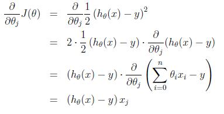

（此处用到了一些微积分的知识，我们在前面定义了$$ J(\theta)=\frac {1}{2} \sum_{i=1}^{m} {(h_\theta(x^{(i)})-y^{(i)})^2} $$  ，此处把 $J(\theta)$ 代入公式后进行复合函数求导。前面也提到了 $$ h(x)=\sum_{i=0}^{n}{\theta_ix_i} $$   ，整体对 $\theta_j$ 求导只剩下 $x_j$ 。如果此处推导看不懂，建议回头去看看上面对数学符号的约定以及复习一下微积分相关内容。）  

对单个训练样本，更新规则如下所示：  

$$ \theta_j:=\theta_j +\alpha (y^{(i)}-h_\theta(x^{(i)}))x_j^{(i)} $$

这个规则叫做 **LMS** 更新规则（LMS是 “least mean squares”，即最小均方的缩写），也被称为 **Widrow-Hoff** 学习规则。它有几个属性看起来是十分自然和直观的。例如，每次更新的大小与  **误差（error）** 项 $ (y^{(i)}-h_\theta(x^{(i)})) $是成比例的；另外，当训练样本的预测值与真实值 $y^{(i)}$ 非常接近的情况下，对参数进行更新的幅度就会很小；相比之下，如果我们的预测 $h_\theta(x)$ 有一个非常大的误差（比如距离 $y^{(i)}$非常的远），参数的变化就会变得大得多。  

当训练样本只有一个的时候，我们推导出了LMS规则。当训练集的样本数量不止一个的时候，有两种方式来修改这个算法。第一个是用下面的算法替换它：  

读者能够很容易地证明，在上面这个更新规则中求和项的值就是 $\partial J(\theta)/\partial\theta_j$（根据对 $J$ 的原始定义）。所以这个更新规则实际上就是对原始的成本函数 $J$ 进行简单的梯度下降。此方法在每一个更新步骤中检查整个训练集中的所有训练样本，也叫做**批量梯度下降法（batch gradient descent）**。这里要注意，因为梯度下降法容易被局部最小值影响，而这里我们要解决的这个线性回归的优化问题只有一个全局的最优解，没有其它的局部最优解；因此，梯度下降法应该总是收敛到全局最小值（假设学习速率 $\alpha$ 没有设置的过大）。可以证明出，这里的 $J$ 是一个凸的二次函数。下面是一个样例，表明对一个二次函数使用了梯度下降法来找到最小值。  

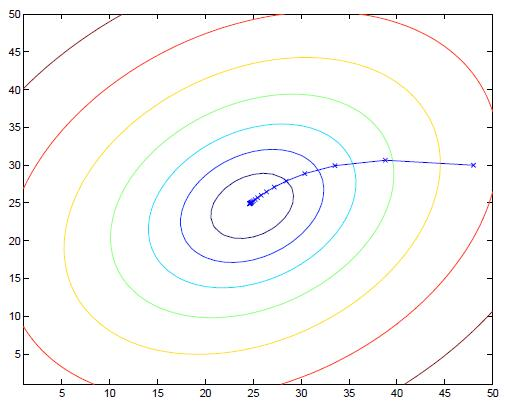

上图所示的椭圆就是一个二次函数的轮廓图。图中显示了梯度下降的轨迹，初始点位置在(48,30)。图中的画的 $x$（用直线相连）标记了梯度下降法所经过的 $\theta$ 的可用值。  

对我们之前的房屋数据集进行批量梯度下降来拟合 $\theta$ ，即把房屋价格当作关于房屋面积的一个函数来进行预测，我们得到的结果是 $\theta_0=71.27, \theta_1=0.1345$ 。如果把 $h_\theta(x)$ 关于 $x$ （面积）的函数绘制出来，同时标上训练数据的点，我们会得到下面的图像：  

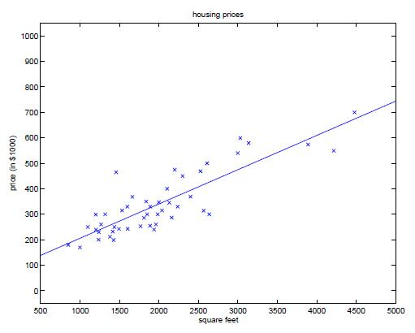

如果添加上卧室数量作为输入特征，那么得到的结果就是 $θ_0 = 89.60, θ_1 = 0.1392, θ_2 = −8.738$.  

上面的结果就是使用批量梯度下降法来获得的。此外还有另外一种方法能够替代批量梯度下降法，这种方法效果也不错。如下所示：  

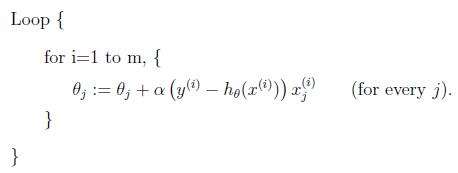

在这个算法里，我们对整个训练集进行了循环遍历，每次遇到一个训练样本，只针对那个单一的训练样本的误差的梯度来对参数进行更新。这个算法叫做**随机梯度下降法（stochastic gradient descent）**，或者叫**增量梯度下降法（incremental gradient descent）**。  

批量梯度下降法要在运行第一个步骤之前先对整个训练集进行扫描遍历，当训练集的规模 m 变得很大的时候，因此引起的性能开销就很不划算了；随机梯度下降法就没有这个问题，而是可以立即开始，它对处理到的每个样本都进行单独运算。通常情况下，随机梯度下降法查找到足够 “接近（close）“ 最低值的参数 $\theta$ 的速度要比批量梯度下降法更快一些。（注意，也有可能会一直无法 ”收敛（converge）“ 到最小值，这时候 $\theta$ 会一直在 $J(\theta)$ 的最小值附近震荡；不过在通常情况下，在最小值附近的这些值也足够接近真实最小值了，足以满足咱们的精度要求，所以也可以被使用。当然更常见的情况是我们事先对数据集已经有了描述，并且有了一个确定的学习率 $\alpha$ ，然后进行随机梯度下降，同时逐渐让学习速率 $\alpha$ 随着算法的执行而逐渐趋于0，这样也能保证我们最后得到的参数会收敛到最小值，而不是在最小值范围进行震荡。）由于以上种种原因，通常更推荐使用的都是随机梯度下降法，而不是批量梯度下降法，尤其是在训练用的数据集规模很大的时候。  

## 2 正规方程（The normal equations）

梯度下降给出了一种最小化 $J$ 的方法。让我们谈一下另一种实现方法，它显式地执行了最小化，而且不需要采用迭代算法。这种方法就是：通过精确求出 $\theta_j$ 处的导数，并且使它们为0，来最小化 $J$ 。要想实现这个目的，不必去写一大堆代数公式或者好几页含有微分的矩阵，让我们先介绍一些矩阵微分运算的符号。

### 2.1 矩阵微分（Matrix derivatives）

假设有一个函数 $ f: \mathbb R^{m\times n} \mapsto \mathbb R$ ，表示从 $m \times n$ 矩阵映射到实数域，那么就可以定义函数 $f$ 关于 $A$ 的导数为如下形式：  

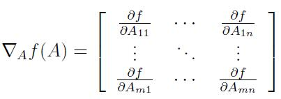

因此，这个梯度  $ \nabla_A f(A)  $ 本身也是一个 $m \times n$ 的矩阵，其中的第 $(i,j)$ 个元素是 $\partial f/ \partial A_{ij}$。举个例子，假如

$$
A=\begin{vmatrix} A_{11} & A_{12} 
               \\ A_{21} & A_{22} 
  \end{vmatrix}
$$

是一个 $2 \times 2$ 矩阵，然后给定的函数 $ f:\mathbb R^{2\times 2} \mapsto \mathbb R $ 为：

$$ f(A) = \frac {3}{2}A_{11}+5A_{12}^2+A_{21}A_{22} $$

这里的 $ A_{ij} $ 表示的意思是矩阵 $A$ 的第 $(i,j)$ 个元素，于是就有了梯度：

$$ \nabla _A f(A)  =\begin{bmatrix} \frac{3}{2} & 10A_{12} \\	A_{22} & A_{21} \\ \end{bmatrix} $$

接下来我们还要引入 **trace** 求迹运算，简写为 **tr**。对于一个给定的 $n \times n$ 的方阵$A$，它的迹定义为对角项之和：

$$ trA=\sum_{i=1}^n A_{ii} $$

假如 $a$ 是一个实数（可以看做是一个 $1\times 1$ 的矩阵），那么就有 tr $  a = a$。（如果你之前没有见到过这个“运算记号”，就可以把 $A$ 的迹看成是 $tr(A)$，或者理解成为一个对矩阵 $A$ 进行操作的 "trace" 函数。不过通常情况都是写成不带括号的形式更多一些。）

如果有两个矩阵 $A$ 和 $B$，能够满足 $AB$ 为方阵，trace 求迹运算就有一个特殊的性质： tr $AB$ = tr $BA$ . (自己想办法证明！) 在此基础上进行推论，就能得到类似下面这样的等式关系：

$$trABC=trCAB=trBCA$$

$$trABCD=trDABC=trCDAB=trBCDA$$

下面这些和求迹运算相关的等量关系也很容易证明。其中 $A$ 和 $B$ 都是方形矩阵，$a$ 是一个实数：

$$ trA=trA^T $$

$$ tr(A+B)=trA+trB $$

$$ tr aA = a tr A$$

接下来我们在不进行证明的情况下提出一些矩阵微风（其中一些直到本节末尾才用得上）。另外要注意等式（4）$A$ 必须是非奇异方形矩阵（non-singular square matrices），而 $|A|$ 表示的是矩阵 $A$ 的行列式。那么我们就有下面这些等量关系：

为了让咱们的矩阵运算记号更加具体，咱们就详细解释一下上述等式中的第一个。假如我们有一个确定的矩阵 $B \in \mathbb R^{n\times m}$（注意顺序，是$n\times m$，这里的意思也就是 B 的元素都是实数，B的形状是 $n\times m$ 的一个矩阵），那么接下来就可以定义一个函数 $ f:\mathbb R^{m\times n} \mapsto\mathbb R $ ，对应这里的就是 $f(A) = trAB$。这里要注意，这个矩阵是有意义的，因为如果 $A \in \mathbb R^{m\times n}$，那么 $AB$ 就是一个方阵，是方阵就可以应用 trace 求迹运算；因此，实际上 $f$ 映射的是从 $\mathbb R^{m\times n} $ 到 实数域 $\mathbb R $ 。这样接下来就可以使用矩阵导数来找到 $\nabla_A f(A)$，这个导函数本身也是一个 $m\times n$ 的矩阵。上面的等式 (1) 表明了这个导数矩阵的第 $(i, j)$ 个元素等同于 $B^T$的第 $(i, j)$ 个元素，或者直接表示成 $B_{ji} $ 。  

上面等式 (1-3)  都很简单，证明就都留给读者做练习了。等式 (4) 需要用逆矩阵的伴随矩阵来推导出。

### 2.2 再谈最小二乘（Least squares revisited）

了解了矩阵求导的原理后，现在让我们来找到最小化 $J(\theta)$ 的 $\theta$ 值的闭型（closed-form）。首先我们需要用矩阵-向量化符号来重写 $\theta$ .  

给定一个训练集，定义 **设计矩阵（design matrix）** $X$ 为 $m \times n$ 矩阵（如果包括截距项的话，事实上是 $m \times (n+1)$ 矩阵），其中每一行为训练样本的输入值：  

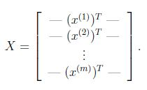

同时，用 $\overset{\rightarrow} y $ 表示一个 $m$ 维向量，其中包含了训练集中所有的样本的目标值：  

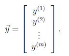

现在，由于 $h_\theta(x^{(i)})=(x^{(i)})^T \theta$ ，我们可以很容易地证明：  

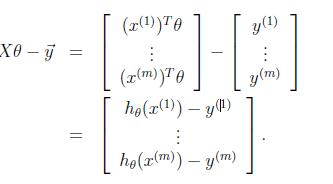

而利用对于向量 $z$ 的性质，我们知道 $z^Tz=\sum_i z_i^2$ ，因此有：  

我们的最终目的是使 $J$ 最小，接下来需要找到它关于 $\theta$ 的导数。联合前面的 (2) 和 (3) 式子，我们可以得到：  

所以：  

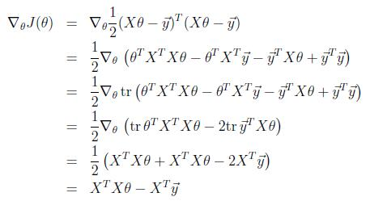

在上面推导过程的第三步中，我们用到了一个定理，即一个实数的迹是它本身；第四步用到了 $trA=trA^T$ 这个定理，最后一项不含 $\theta$ 求导时可舍去；第五步使用了等式 (5) ，令 $A^T=\theta, B=B^T=X^TX, C=I$ ，以及等式 (1) ，即 $\nabla_A trAB = \nabla_A trBA=B^T$ 。为了最小化 $J$ ，我们令导数为0，就得到了它的 **正规方程（normal equations）** ：  

$$ X^TX\theta =X^T\overset{\rightarrow} y  $$

因此，最小化 $J(\theta)$ 的 $\theta$ 的闭式解（解析解）如下：  

$$ \theta= (X^TX )^{-1}X^T\overset{\rightarrow} y   $$

